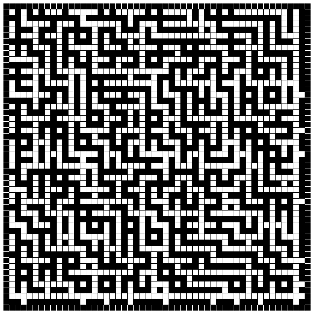
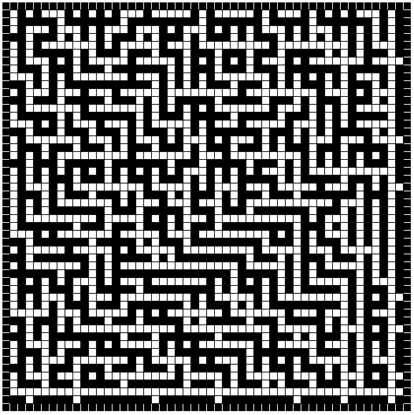
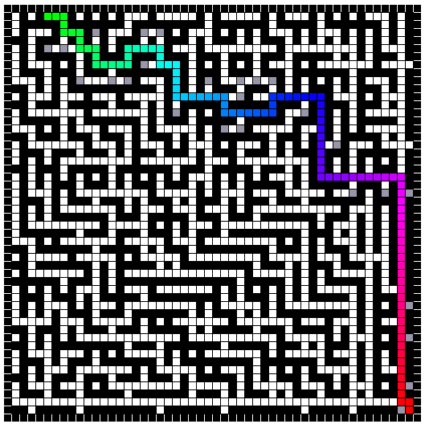

# MazeSolvingAlgos
***MazeSolvingAlgos*** is a Python module written in C++ for generating and solving rectangular Mazes with **Graph Traversal Algorithms**. This Module is a part of **TurtleInTheMaze** Project so it's especially created for ***2D grids***. *You can see **full documentation [here](https://github.com/MahmoudHussienMohamed/MazeSolvingAlgos/wiki/Documentation)***.
## Content of module
* Helper Classes
    * Index 
    * RandomMazeGenerator 
* Solving Algorithms Classes
    - DepthFirstSearch
    - BreadthFirstSearch
    - DijkstraAlgorithm
    - AStar
    - BellmanFord
    - FloydWarshall

## How to install
Simply with pip:

`pip install MazeSolvingAlgos`
## How to use
### RandomMazeGenerator
Use `RandomMazeGenerator` class with arguments `H`, `W`: Height and Width of the maze respectively and call `generate()` to get **W** × **H** random maze (`H`, `W` must be unsigned integers and prefered to be even numbers).
``` Python
RMG = RandomMazeGenerator(50, 50) 
maze = RMG.generate()             # Now, maze is 50 * 50 random cells 
```
50 × 50 random maze from ***TurtleInTheMaze*** project:



### Index
Use `Index` class with arguments `row`, `col` to encapsulate a 2D cell's position and to pass `start` and `end` parameters to any ***Graph Traversal Algorithm*** (***Note that `row` and `col` must be unsigned integers***).

``` Python
idx = Index(2, 13) 
print(idx)             # output: "2, 13" 
print(f"cell's column = {idx.col}, cell's row = {idx.row}")             
# output: "cell's column = 13, cell's row = 2"
```
### GTAs
Let GTA be any solving algorithm; GTA accepts `grid`: 2D boolean list representing the maze (*`True` for **orifice** and `False` for **block or wall***), `start`: `Index` object representing the position of starting cell and `end`: same as `start` for the destination cell.
``` Python
WIDTH = HEIGHT = 50
RMG = RandomMazeGenerator(HEIGHT, WIDTH) 
maze = RMG.generate()
start = Index(0, 4)
end = Index(49, 49)

solver = AStar(maze, start, end)    # Convert the maze to Graph. 
solver.solve()                      # Fires the algorithm logic.
solver.SrcToDestDistance()          # Exact cells' number from start to end cell.
solver.SrcToDestPath()              # List of Index objects representing route. 
solver.TraversedNodesNo()           # Number of cells the algorithm visited (may be > total cells of maze).
solver.TraversedNodes()             # List of Index objects representing unique traversed cells. 
```



(*Traversed cells are gray and solution is the colorful colorful path from green to red*)

Note that:
* Any algorithm have same constructor and methods including but not limited to `Astar`.
* `SrcToDestDistance()` != `len(SrcToDestPath())` and `TraversedNodesNo()` != `len(TraversedNodes())` because I implemented the graph to be weighted for some algorithms and elemenate useless cells to increase memory efficiency and perfomance.

## Source Files
* [MazeGenerator.h](src/MazeGenerator.h): Header file contains `RandomMazeGenerator` class.
* [Graph.h](src/Graph.h): Header file contains most preprocessing (`Unweighted`/`weightedGraph`, `...`).
* [GraphTraversalAlgorithms.h](src/GraphTraversalAlgorithms.h): Header file contains all solving Algorithms.
* [main.cpp](src/main.cpp): Source file which handle Python–C++ binding with pybind11.
* [setup.py](src/setup.py) and [pyproject.toml](src/pyproject.toml): Helper files for packaging the project.
